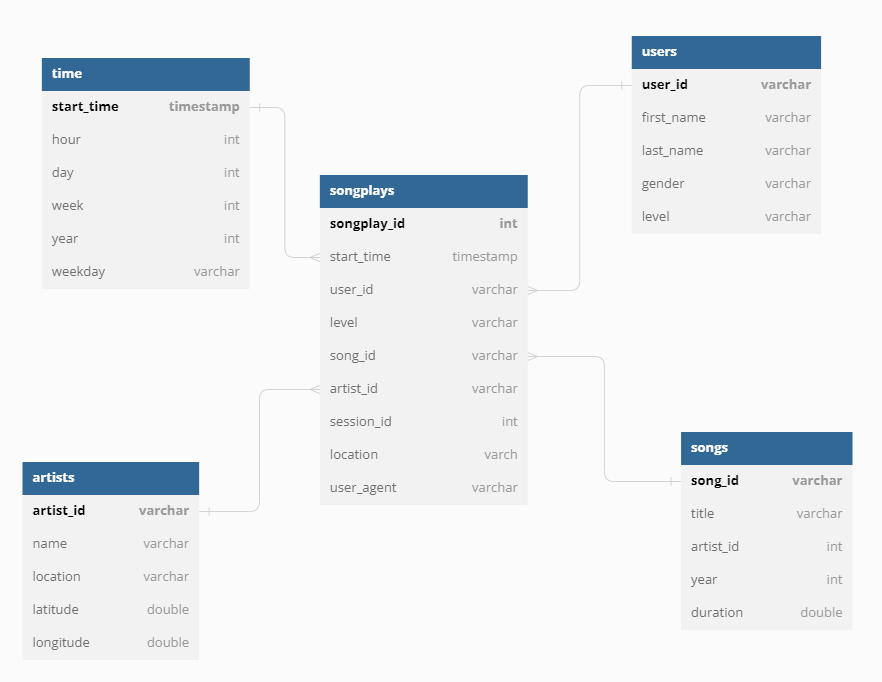

# Sparkify Data Warehouse

#### [Optional] You can run follow jupyter notebook `dwh.ipynb`
## Run
1. Create `.credential.cfg` file that look like this
    ```
    [AWS]
    KEY=XXXXXXXXXXXXXXXXX
    SECRET=XXXXXXXXXXXXXXXXXXXXXXXX
    ```
2. Create tables
   ```
   python3 create_tables.py
   ```
3. Run ETL pipeline
   ```
   python3 etl.py
   ```

## Schema
#### Fact Table
- **songplays** - records in event data associated with song plays i.e. records with page NextSong
songplay_id, start_time, user_id, level, song_id, artist_id, session_id, location, user_agent
#### Dimension Tables
- **users** - users in the app
user_id, first_name, last_name, gender, level
- **songs** - songs in music database
song_id, title, artist_id, year, duration
- **artists** - artists in music database
ar*tist_id, name, location, lattitude, longitude
- **time** - timestamps of records in songplays broken down into specific units
start_time, hour, day, week, month, year, weekday


<!-- ## Analytical Goals
The goals of this datawarehouse is to analyze relationship of user's gender and song, artist.

1. Which gender listened to the music from the given song title the most?
2. Which gender listened to the music from the given artist name the most? -->
